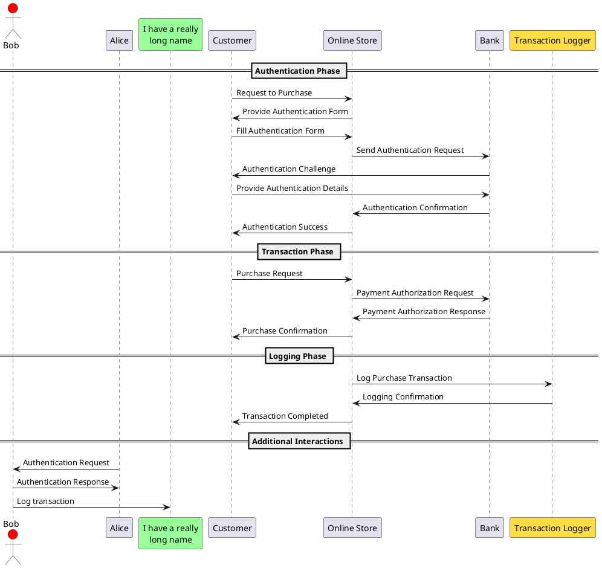

下面是一个泳道图

```plantuml
@startuml
actor Bob #red
participant Alice
participant "I have a really\nlong name" as L #99FF99
participant Customer
participant "Online Store" as Store
participant Bank
participant "Transaction Logger" as Logger #FFDD44

== Authentication Phase ==
Customer -> Store: Request to Purchase
Store -> Customer: Provide Authentication Form
Customer -> Store: Fill Authentication Form
Store -> Bank: Send Authentication Request
Bank -> Customer: Authentication Challenge
Customer -> Bank: Provide Authentication Details
Bank -> Store: Authentication Confirmation
Store -> Customer: Authentication Success

== Transaction Phase ==
Customer -> Store: Purchase Request
Store -> Bank: Payment Authorization Request
Bank -> Store: Payment Authorization Response
Store -> Customer: Purchase Confirmation

== Logging Phase ==
Store -> Logger: Log Purchase Transaction
Logger -> Store: Logging Confirmation
Store -> Customer: Transaction Completed

== Additional Interactions ==
Alice -> Bob: Authentication Request
Bob -> Alice: Authentication Response
Bob -> L: Log transaction
@enduml
```